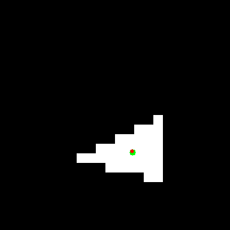
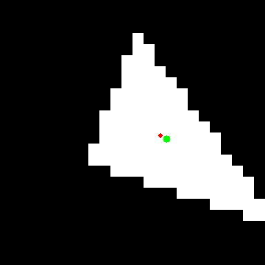
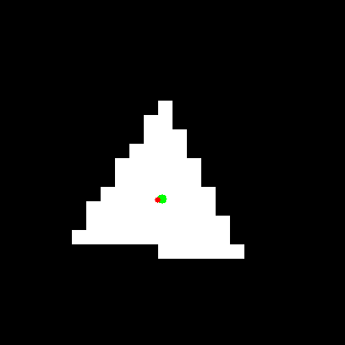
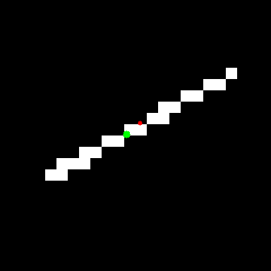

This test demonstrates the functionality of Conv2D.

The following images showcase some of the model's predictions after 10 epochs (iterations over the training dataset).  The green dot is the true centroid of the triangle, and the red dot is the predicted centroid.  Further training improves accuracy.

